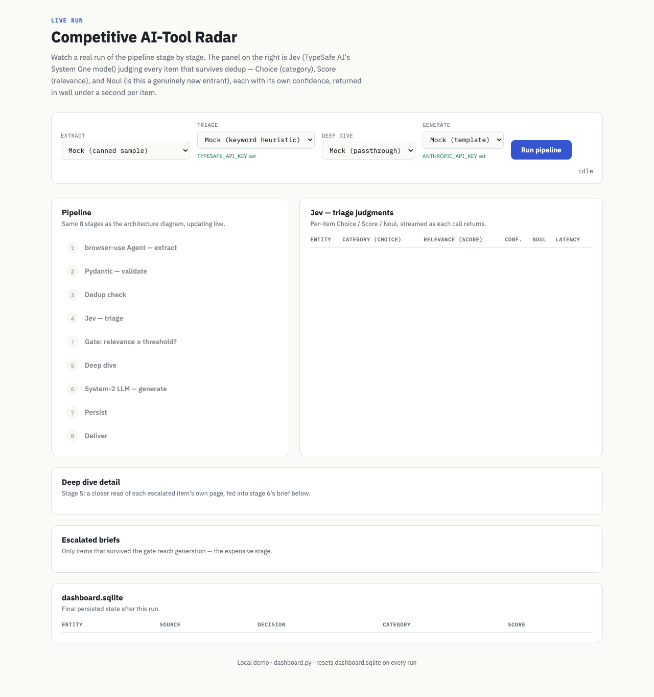
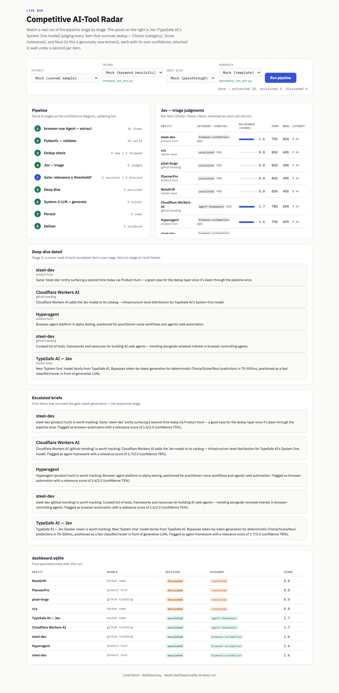
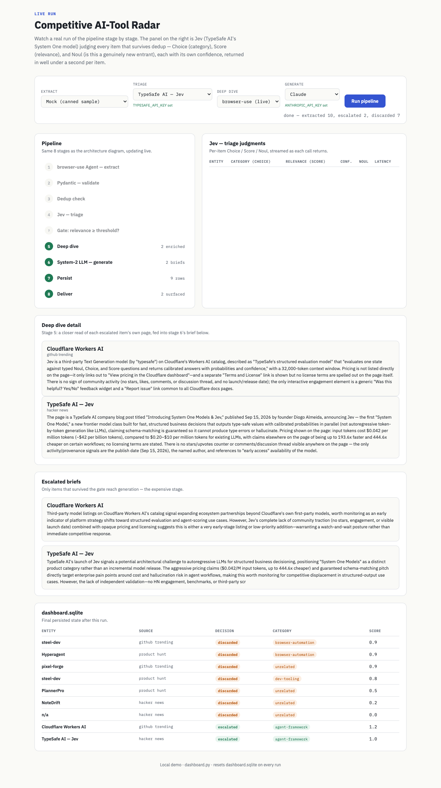
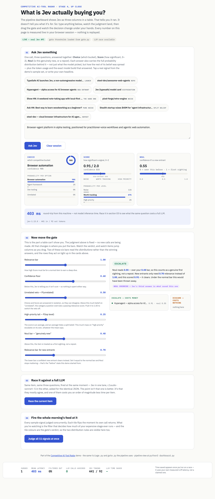
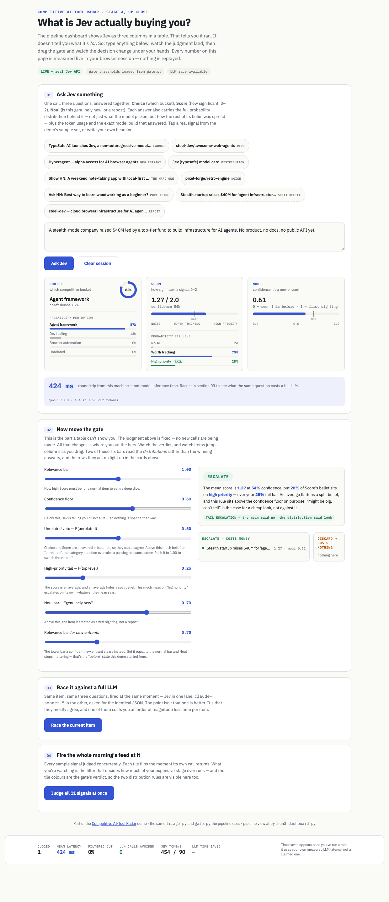
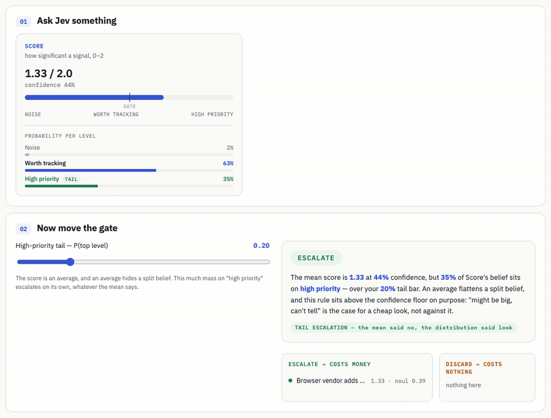
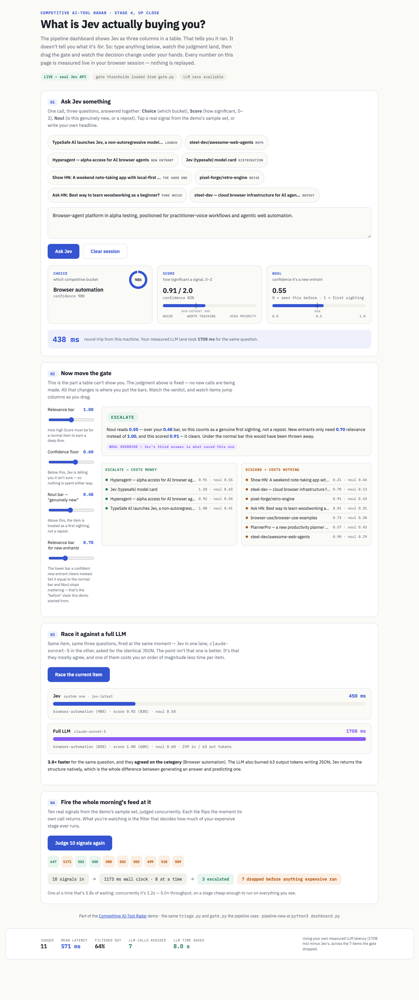

# Competitive AI-Tool Radar — runnable demo

[](https://github.com/Laksh-star/radar-demo)

This is the pipeline from the architecture diagram, actually running. Every
stage has a real implementation now; the ones needing a paid API key fall
back to a free mock when the key isn't set, so it always runs end to end.

## Run it

```
pip install -r requirements.txt
cp .env.example .env      # then fill in whichever keys you have — all optional
python3 pipeline.py
```

It resets `dashboard.sqlite`, seeds one entity as "already seen from
yesterday" (so you can watch dedup actually skip something), then runs all
8 stages and prints a trace — item counts at every stage, which items got
discarded and why, which ones got a generated brief, and the final rows
written to the local SQLite "dashboard."

### Configuration — `.env`

Every real integration (TypeSafe AI, Anthropic) reads its key from the
environment, loaded automatically from a local `.env` file via
`python-dotenv` (see `pipeline.py`/`dashboard.py`'s `load_dotenv()` call).
`.env.example` documents every variable; copy it to `.env` and fill in
whatever you have — anything you leave blank just falls back to that
stage's free mock. `.env` itself is gitignored, so cloning this repo never
exposes real keys, and anyone can run the full pipeline with zero setup
(all mocks) before adding any keys at all.

### Or watch it run in a browser

```
python3 dashboard.py
open http://localhost:5050
```

Same pipeline, same `run_pipeline()` in `pipeline.py` — just rendered live
instead of printed. Pick providers from the dropdowns (a key badge tells you
whether `TYPESAFE_API_KEY` / `ANTHROPIC_API_KEY` are set) and hit **Run
pipeline**. The 8 stages light up as they run, and the right-hand panel
streams Jev's Choice/Score/Noul judgment for every item the moment each
call returns, with its confidence and latency — that panel is the point of
the dashboard: it's the only stage in the pipeline making a real per-item
judgment call fast enough to watch happen live.

**Idle, before a run:**



**After a completed run** — all 8 stages, Jev's live judgments, stage 5's
deep-dive detail, the generated briefs, and the final persisted state:



**A real run** — real Jev triage, real browser-use deep dive, real Claude
generation (the mock run above only differs in provider choice, not in what
the UI shows):



### Or touch the judgment layer directly

```
python3 playground.py
open http://localhost:5051
```

The dashboard answers *"does the pipeline run?"*. The playground answers
*"what is Jev actually buying me?"* — it pulls stage 4 out of the table and
makes it something you can poke at. Same `triage.py`, same `gate.py`, same
`TriageResult` contract; only the framing is different.



Four things you can do with your hands:

1. **Ask Jev something** — tap one of the sample signals or type your own
   headline, and watch Choice / Score / Noul land together with their
   confidences, the **full probability distribution behind each answer**,
   the token usage, and the exact model build that answered
   (`jev-1.13.0`, not the `jev-latest` alias the request asks for). The
   distributions are the part worth staring at: a 0.99/0.01 split and a
   0.51/0.49 split both render as one confident-looking label until you see
   the shape behind them.
2. **Move the gate** — six sliders for the thresholds in `gate.py` (loaded
   from it at page load, not hardcoded in the page). The judgment stays
   fixed; no new calls are made. Only the bars move, and the verdict flips
   under your hand with a plain-English sentence naming the rule that
   decided it. Two of the six read the distributions rather than the winning
   answers, and the distribution row a rule is acting on lights up in the
   cards above as its threshold crosses it — so **NOUL OVERRIDE**,
   **UNRELATED VETO** and **TAIL ESCALATION** are all things you can make
   fire with your thumb.

   

   Five seconds of it, since a still can't show the part that matters —
   dragging the high-priority tail bar past this item's tail, and watching
   the verdict fall through to the confidence floor that used to decide it:

   
3. **Race a full LLM** — the same three questions go to Jev and to Sonnet at
   the same moment, asked for identical JSON. Both lanes show their answer,
   their latency and their token usage. Measured runs came in at 3.8–5.3×
   faster for the same verdict. Worth noting honestly: Jev is not
   automatically the cheaper *in tokens* — one measured pair was Jev 441
   in / 92 out against the LLM's 239 in / 63 out, because the question
   criteria travel with every Jev call. The two price tokens very
   differently, so the page calls that a usage comparison, not a cost one.
   Latency is the measured claim here; cost isn't, and the page says so.
4. **Fire a batch** — all 10 sample signals judged concurrently (8 at a
   time), each tile flipping as its own call returns, ending in the funnel:
   how many came in, how many escalated, how many were dropped before
   anything expensive ran.



Every number on that page is measured in your own session — nothing is
replayed from `benchmark/stats.json`. The bottom ledger only shows "LLM time
saved" *after* you've run a race, because until then it has no measured LLM
latency to subtract, and it won't quote a claimed one. With no
`TYPESAFE_API_KEY` set it runs the same page against `MockTriage` and the
badge says so; the race lane needs `ANTHROPIC_API_KEY` and disables itself
without one.

## Benchmark data

`benchmark/run_benchmark.py` runs the pipeline once against the fixed mock
extraction batch (so the input set stays constant) with real Jev triage,
real deep dive, and real Claude generation, and writes per-item data plus
aggregate stats to `benchmark/stats.json` — including the resolved model
builds that answered and total token usage, so a stats file can say what it
measured rather than just what it asked for. (The committed `stats.json`
predates those two fields; the next run regenerates it with them.) `benchmark/trace.txt` is a
cleaned console trace from one such run. Headline numbers from that run:

- 9 real Jev calls against **jev-1.13.0**: latency 384.6-511.6ms (mean
  456.5ms, median 451.4ms) — essentially inside the 70-500ms band in
  TypeSafe's own materials, with only the slowest call 2% over. An earlier
  run of this same benchmark measured 831.6-927.8ms on the same machine
  against the same inputs. What changed between them isn't established: that
  run didn't record the model build, so it can't even be ruled in or out.
  Time of day, network path and build are all plausible, and this is
  round-trip HTTP latency from a local machine either way, not model
  inference time.
- 4,006 input / 819 output tokens across the 9 calls (445 / 91 per call)
- 2 of 9 items escalated — the gate filtered 78% before either expensive
  stage (deep dive, generation) ran on them
- **Which rule decided**: 4 discards by the unrelated veto, 3 below the
  relevance bar, 1 escalation on the bar, and 1 on the high-priority tail.
  That last one is Cloudflare Workers AI at relevance 1.27 with 52%
  confidence: under the gate as it stood before the distributions were
  wired in, the confidence floor would have discarded it despite the high
  score. The tail rule caught it because 30% of Score's belief sat on "high
  priority"
- 0 Noul overrides in this run — the mechanism has its own boundary tests in
  `test_gate.py`; this run's input just didn't contain a case for it

```
python3 benchmark/run_benchmark.py   # needs TYPESAFE_API_KEY + ANTHROPIC_API_KEY
```

## What's real vs. mocked

| File | Status | Notes |
|---|---|---|
| `models.py` | real | the `RawSignal` / `TriageResult` / `Signal` Pydantic contracts |
| `extract.py` | real | pluggable `ExtractionProvider` interface — `BrowserUseExtract` runs a real browser-use `Agent` against Hacker News / GitHub Trending (Product Hunt excluded, see below), `MockExtract` returns the canned `sample_sources.py` batch (all 3 sources) |
| `triage.py` | real | pluggable `TriageProvider` interface — `TypeSafeTriage` makes the real `/v1/systemone` call and keeps the *whole* response (answers, per-option and per-level probability distributions, level legend, token usage, resolved model build), `MockTriage` is the original keyword heuristic kept as a no-key fallback |
| `gate.py` | real | five ordered rules over Jev's three answers *and* the two distributions behind them — returns the reason, not just a boolean; see below |
| `test_gate.py` | real | boundary tests for every gate threshold and both ordering decisions — no pytest, no key, no network |
| `store.py` | real | SQLite-backed dedup table + persistence — stands in for your `create_brief` / `get_trending_competitors` tools |
| `deep_dive.py` | real | pluggable `DeepDiveProvider` interface — `BrowserUseDeepDive` opens each escalated item's own url and summarizes what's actually there, `MockDeepDive` passes the stage-1 description straight through |
| `generate.py` | real | pluggable `GenerateProvider` interface — `ClaudeGenerate` calls the Anthropic API using stage 5's enriched detail, `MockGenerate` is the original templated placeholder kept as a no-key fallback |
| `pipeline.py` | real | `run_pipeline()` orchestrates all 8 stages and emits an event per step; `pipeline.py`'s own `main()` prints a trace, `dashboard.py` renders those same events live |
| `dashboard.py` | real | Flask + Server-Sent Events; a local web view of a run, with a dedicated live panel for Jev's per-item judgments |
| `playground.py` | real | Flask + SSE hands-on view of stage 4 alone — live Jev calls, draggable `gate.py` thresholds, a same-moment Jev-vs-LLM race, and a concurrent batch |

Every stage now has a real path — including stage 5's deep dive, which
opens each escalated item's own url and hands `generate.py` a couple of
concrete facts instead of just the stage-1 blurb. Every real integration
either runs for real when its key is set, or falls back to a free, keyless
mock so the pipeline always completes.

### The gate reads the distributions, not just the winning answers

Jev returns three answers per item — Choice (category), Score (relevance),
Noul (is this genuinely new) — and, alongside each one, the probability
distribution it came from. The gate has been through two rounds of the same
mistake: first Noul was requested, displayed and persisted but never changed
a decision; then the distributions were captured but only drawn. Both are
now load-bearing. `gate.decide()` applies five rules in order:

```python
# gate.py — abridged; each rule also returns a sentence explaining itself
if p_unrelated >= UNRELATED_VETO_THRESHOLD:            # 0.50
    return DISCARD   # Choice disagrees with Score — side with Choice
if p_high >= HIGH_PRIORITY_TAIL_THRESHOLD:             # 0.25
    return ESCALATE  # fat tail on "high priority", whatever the mean says
if relevance_confidence < CONFIDENCE_THRESHOLD:        # 0.60
    return DISCARD   # Jev says don't trust this answer
if is_new_entrant >= NEW_ENTRANT_THRESHOLD:            # 0.70
    return relevance_score >= NEW_ENTRANT_RELEVANCE_THRESHOLD   # lower bar: 0.7
return relevance_score >= RELEVANCE_THRESHOLD          # normal bar: 1.0
```

**The unrelated veto.** TypeSafe's docs say every question in a call is
evaluated "in parallel and in isolation" — which means they can disagree,
and a winning label per question hides it. An item can score 0.88 relevance
while Choice puts 87% of its belief on *unrelated*. Escalating that means
paying for one question's opinion and ignoring the other's, so the veto
discards it. On a real run over the sample set this fires on four items.

**The high-priority tail.** `relevance_score` is an expectation, and an
expectation flattens a split belief: 0.45 Noise / 0.10 Worth / 0.45 High
priority averages to about the same number as a confident "worth tracking"
and means something completely different. So enough mass on the top level
escalates on its own.

**Why the tail sits above the confidence floor.** It was written below it
first, and that made it very nearly dead code. Measured against realistic
headlines — "stealth startup raises $40M for agent infrastructure", "browser
vendor ships a native agent API" — the items with a fat high-priority tail
are almost exactly the items Jev is least confident about: five test signals
came back at 0.28–0.52 confidence with 0.31–0.62 of their belief on the top
level, and the floor killed every one before the tail was consulted. But
"this might be significant and the model can't tell" is the case for
spending a cheap look, not against it. Moving the rule up changed the
composition of what escalates without changing the volume: the sample set
still filters 7 of 9.

Every rule that isn't "the score cleared the bar" is visible rather than
logged: `gate.decide()` returns the reason and a sentence, the CLI trace
prints `NOUL OVERRIDE` / `UNRELATED VETO` / `TAIL ESCALATION` lines, the
dashboard badges the responsible cell, and the playground names the rule and
lights up the exact distribution row that triggered it.

**Anything Jev doesn't supply is skipped, not guessed.** `MockTriage`
returns no distributions, so rules 1 and 2 never fire and the gate behaves
exactly as it did before they existed — the all-mock pipeline output is
unchanged, byte for byte.

`test_gate.py` covers all of it — every threshold at, just under and just
over, plus the two ordering decisions:

```
python3 test_gate.py    # no pytest, no API key, no network
```

### Extract provider selection

`extract.get_extract_provider()` reads `EXTRACT_PROVIDER` from the
environment. Unlike triage/generate below, this **defaults to `mock`** even
when `ANTHROPIC_API_KEY` is set — a live 3-site crawl takes ~30-90s and
spends several LLM calls, so it needs an explicit opt-in rather than
piggybacking on a key set for another stage:

- unset or `mock` → the canned `sample_sources.py` batch, no key/network/browser
- `browser-use` → a real browser-use `Agent` (needs `ANTHROPIC_API_KEY` — this
  drives the *browsing* agent, unrelated to Jev, which only judges afterward).
  It launches its own isolated headless Chromium (a temp profile via the
  `browser-use` package), not your regular browser.

**Product Hunt is excluded from the live crawl.** It sits behind a
Cloudflare "verify you're human" challenge that a headless agent gets stuck
on indefinitely trying (and failing) to click through — observed 12+ steps
with no resolution in testing. We don't attempt to solve bot-detection
challenges, so `BrowserUseExtract` only hits Hacker News and GitHub
Trending live; Product Hunt items only ever come from `MockExtract`'s
sample data. Each source is also capped at 15 agent steps
(`_MAX_STEPS_PER_SOURCE` in `extract.py`) so any *other* site that traps
the agent fails fast and cheap instead of grinding — `agent.run()` defaults
to 500 steps, which is a lot of real LLM calls to burn on a stuck page.

```
# in .env: ANTHROPIC_API_KEY=... and EXTRACT_PROVIDER=browser-use
python3 pipeline.py

# or without .env:
ANTHROPIC_API_KEY=your-key-here EXTRACT_PROVIDER=browser-use python3 pipeline.py
```

### Triage provider selection

`triage.get_triage_provider()` reads `TRIAGE_PROVIDER` from the environment:

- unset → `typesafe` if `TYPESAFE_API_KEY` is set, else `mock`
- `typesafe` → real call to TypeSafe AI's `/v1/systemone` (needs `TYPESAFE_API_KEY`)
- `mock` → the original keyword heuristic, no key or network needed

```
# in .env: TYPESAFE_API_KEY=...
python3 pipeline.py            # uses TypeSafeTriage

TRIAGE_PROVIDER=mock python3 pipeline.py   # forces the free heuristic
```

Both implement the `TriageProvider` interface (`triage(raw: RawSignal) ->
TriageResult`), so `gate.py`, `pipeline.py`, and everything downstream don't
care which one ran.

### Deep dive provider selection

`deep_dive.get_deep_dive_provider()` reads `DEEP_DIVE_PROVIDER` from the
environment. Like extraction, this **defaults to `mock`** even when
`ANTHROPIC_API_KEY` is set — it's an extra browser-use pass per escalated
item, so it needs an explicit opt-in:

- unset or `mock` → passes the stage-1 description straight through, no key/network/browser
- `browser-use` → a real browser-use `Agent` opens the item's own url and
  summarizes what's actually on the page (needs `ANTHROPIC_API_KEY`, same
  headless Chromium approach as extraction, same `BROWSER_USE_HEADLESS`
  toggle and per-item step cap)

```
# in .env: ANTHROPIC_API_KEY=... and DEEP_DIVE_PROVIDER=browser-use
python3 pipeline.py
```

Both implement the `DeepDiveProvider` interface (`dive(raw: RawSignal) ->
str`), so `generate.py` only ever sees the detail string it returns —
identical whether that string came from a real page read or was just the
original blurb. This is why the full-mock pipeline's output is byte-for-byte
unchanged from before this stage existed.

### Generate provider selection

`generate.get_generate_provider()` follows the same pattern, reading
`GENERATE_PROVIDER` from the environment:

- unset → `claude` if `ANTHROPIC_API_KEY` is set, else `mock`
- `claude` → real call to the Anthropic API, using stage 5's enriched detail
  instead of the raw stage-1 description (needs `ANTHROPIC_API_KEY`)
- `mock` → the original templated placeholder, no key or network needed

```
# in .env: ANTHROPIC_API_KEY=...
python3 pipeline.py            # uses ClaudeGenerate

GENERATE_PROVIDER=mock python3 pipeline.py   # forces the free template
```

## What of Jev this demo exercises — and what it doesn't

Checked against TypeSafe's [docs index](https://docs.typesafe.ai/llms.txt)
and a raw probe of the live API, not from memory. ✅ = exercised, ⚠️ =
partly, ❌ = not. Currently **12 exercised, 2 partly, 7 not** — it started at
8 / 4 / 12.

| Jev feature | Exercised | Where, or why not |
|---|:--:|---|
| **Choice** — pick from options | ✅ | category, everywhere |
| **Score** — rate against ordered levels | ✅ | both halves of it: the mean drives the ordinary relevance bar, and the level distribution drives the tail rule. "High priority" and "Worth tracking" now lead to different outcomes, which they didn't when the gate was one threshold on the mean |
| **Noul** — probability a statement is true | ✅ | `gate.py` escalates confident new entrants at a lower bar; the playground makes the override fire on a slider drag |
| Confidence, separate from the answer | ✅ | `gate.py`'s confidence floor. Its interaction with the distributions is the interesting part — the tail rule deliberately outranks it, because the two axes disagree exactly where it matters (see the gate section) |
| Per-option probabilities (Choice) | ✅ | captured, drawn, **and gating** — the unrelated veto in `gate.py` |
| Per-level probabilities + legend (Score) | ✅ | same — the high-priority tail rule |
| `usage` token counts | ✅ | per call in the playground, aggregated in the benchmark |
| Resolved model build | ✅ | `jev-1.13.0` recorded rather than the `jev-latest` alias requested |
| Several questions per call, evaluated in parallel | ✅ | 3 per call — the efficiency the architecture is built on |
| Confidence-gated routing | ✅ | literally what `gate.py` is — five ordered rules, each naming itself in the trace |
| Cheap classifier in front of a generative model | ✅ | the demo's whole thesis — 64–91% filtered before deep dive or generation |
| Structured JSON for criteria | ⚠️ | Choice takes a criteria dict and Score a level list, but `instructions` are plain strings |
| State structuring | ⚠️ | only `raw.description` is sent; the title, source, url and date are held right there and never reach the model |
| Speculative fan-out | ❌ | extra speculative questions in the same call — not attempted |
| Composite scoring | ❌ | one relevance question does all the judging |
| Self-consistency (Noul / Choice variants) | ❌ | not attempted |
| Re-ranking, semantic search, RAG passage classification, citation verification, guardrails, function calling, extraction, hierarchical classification | ❌ | 16+ cookbook patterns, all different use cases from this one |
| Sub-second latency (70–500ms claimed) | ✅ | measured twice on the same machine and inputs eight hours apart: 831.6–927.8ms, then 384.6–511.6ms. The second run is inside the claimed band bar its slowest call; the cause of the gap isn't established and isn't claimed |
| Calibration of those probabilities | ❌ | the distributions are now load-bearing, which makes miscalibration consequential rather than cosmetic — and nothing here tests for it. The biggest honest gap left |
| Official Python / JS SDKs | ❌ | raw `httpx` — no retries, no async client |
| Cloudflare Workers AI distribution | ❌ | appears in `sample_sources.py` as a signal, never as a call path |

Every one of the gate's five rules decides at least one real item. Judging
the 11 sample signals against the live API returns: 4 discarded by the
unrelated veto, 3 below the relevance bar, 2 escalated on the high-priority
tail, 1 escalated on the bar, and 1 discarded on the confidence floor. No
rule in this gate is decoration any more, which took three tries to get
right.

The short version: the judgment layer and everything the API returns
alongside it are now exercised end to end. What's left untouched is a
different shape of thing — composite scoring, self-consistency, speculative
fan-out and the cookbook patterns are all *more calls, differently
arranged*, not more of the response. And calibration, which this demo now
depends on and still doesn't test.

## Making it fully live

1. **Extraction** — done. Set `ANTHROPIC_API_KEY` and `EXTRACT_PROVIDER=browser-use`;
   see "Extract provider selection" above.
2. **Triage** — done. Set `TYPESAFE_API_KEY` and it calls the real API; see
   "Triage provider selection" above.
3. **Deep dive** — done. Set `ANTHROPIC_API_KEY` and `DEEP_DIVE_PROVIDER=browser-use`;
   see "Deep dive provider selection" above.
4. **Generation** — done. Set `ANTHROPIC_API_KEY` and it calls Sonnet; see
   "Generate provider selection" above.
5. **Persistence** — replace the two functions in `store.py` with calls to
   your actual `create_brief` / `get_trending_competitors` tools.

Nothing else needs to change — `gate.py`, `pipeline.py`, and the shapes in
`models.py` don't care where a `RawSignal` or `TriageResult` came from.

## Sample data

`sample_sources.py` isn't random filler. It's built from the actual web
research earlier in this conversation — the TypeSafe AI / Jev launch,
`steel-dev`'s web-agent list, Hyperagent, Cloudflare's Jev model listing —
mixed with a few deliberately irrelevant items (a note-taking app, a
planner app, a game engine, a forum thread) so the gate has real noise to
filter, the way an actual trending page would hand you a mix of both.
